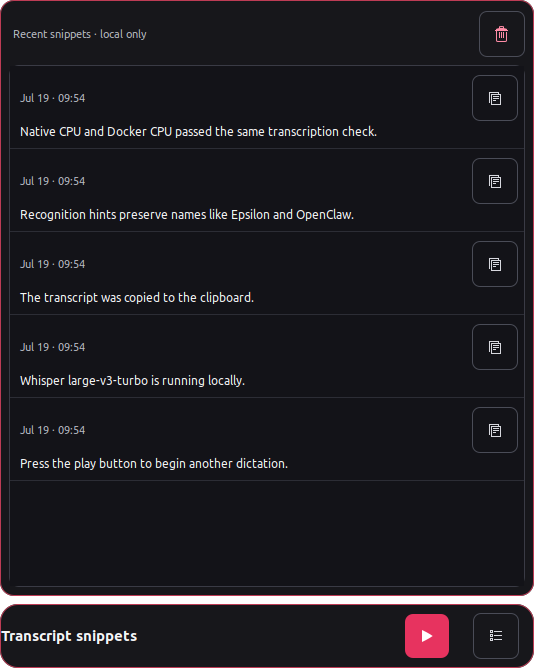
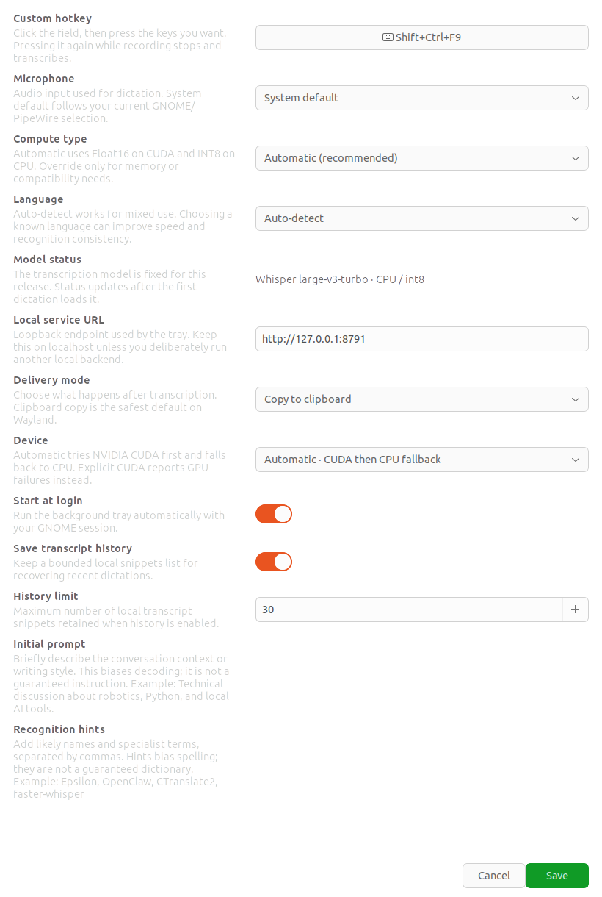

# Epsilon Flow

Raghav's local dictation tool, originally built for working with his Epsilon agent.

Epsilon Flow is a public, local-first Linux dictation app. A GTK3 tray owns a reusable recording listener and local transcript snippets; a loopback FastAPI service runs faster-whisper. It needs no account or cloud API.

## Features

- Press-to-capture GNOME hotkey; press it again to stop and transcribe.
- Restartable systemd user services for the tray and loopback backend.
- Faster-Whisper `turbo` transcription on CPU/INT8 or NVIDIA CUDA/Float16.
- Automatic CUDA-to-CPU fallback when **Device** is set to Automatic.
- Native two-environment install or Docker Compose CPU/CUDA profiles.
- Selectable microphone, language, compute type, device, and delivery mode.
- Configurable Initial Prompt and Recognition Hints for context and specialist names.
- Clipboard copy, paste, virtual typing, or transcript-only delivery.
- Bounded local transcript snippets with explicit play-to-record; opening history never starts the microphone.
- Ubuntu 22.04, 24.04, and 26.04 GNOME/Wayland support.

## Screenshots

### Recording


### Transcript snippets



### Settings



## Ubuntu 22.04, 24.04, and 26.04

Install the desktop/runtime packages (package names are shared by these Ubuntu releases):

```bash
sudo apt update
sudo apt install python3 python3-venv python3-pip python3-gi gir1.2-gtk-3.0 \
  gir1.2-ayatanaappindicator3-0.1 ffmpeg wl-clipboard
# Optional notifications and automatic keyboard insertion:
sudo apt install libnotify-bin ydotool xdotool
```

Install [uv](https://docs.astral.sh/uv/getting-started/installation/), then install Epsilon Flow:

```bash
./scripts/install.sh
```

The installer creates two native environments on purpose:

- `.venv-desktop` uses `/usr/bin/python3 --system-site-packages`, because PyGObject and AppIndicator are distro packages tied to Ubuntu's GTK libraries.
- `.venv-backend` uses uv-managed Python 3.12, giving faster-whisper one consistent runtime across Ubuntu 22.04, 24.04, and 26.04.

The installer creates systemd user services for both the loopback backend and the desktop tray. The backend is always enabled; the tray is enabled at graphical login by default and restarts if it crashes. **Start at login** in Settings controls future login startup without killing the current tray session. Manage them with:

```bash
./scripts/service.sh native-start
./scripts/service.sh native-stop
./scripts/service.sh native-status
./scripts/service.sh native-logs
./scripts/service.sh tray-status
./scripts/service.sh tray-logs
```

Open **Settings…** from the tray to configure the hotkey, login autostart, delivery, history, microphone, device/compute type/language, Initial Prompt, and Recognition Hints. **Save** applies integrations and closes Settings. Pressing the hotkey again stops and finalizes an active recording.

Epsilon Flow currently uses Faster-Whisper's supported `turbo` alias for Whisper large-v3-turbo. It downloads into the normal faster-whisper cache on first use. Advanced Docker deployments can still override `EPSILON_FLOW_MODEL`, but model choice is intentionally fixed in the everyday desktop UI.

## Docker CPU or CUDA backend

The tray remains native; Compose can replace the native transcription service. Stop the native service first because every backend binds `127.0.0.1:8791`.

```bash
./scripts/service.sh native-stop
./scripts/service.sh start cpu
./scripts/service.sh status
./scripts/service.sh stop cpu
```

For CUDA, install the NVIDIA driver and [NVIDIA Container Toolkit](https://docs.nvidia.com/datacenter/cloud-native/container-toolkit/latest/install-guide.html), then verify both host and container access before starting the profile:

```bash
nvidia-smi
docker run --rm --gpus all nvidia/cuda:12.4.1-base-ubuntu22.04 nvidia-smi
./scripts/service.sh start cuda
./scripts/service.sh status
```

If `nvidia-smi` fails after enabling Secure Boot, check that the NVIDIA kernel module is signed/enrolled (or complete your distribution's MOK enrollment) rather than disabling Secure Boot as a first step.

Both profiles publish only loopback. The named volume preserves downloaded models. Override `EPSILON_FLOW_MODEL` and `EPSILON_FLOW_COMPUTE_TYPE` in the environment. Backend **Auto** mode falls back from CUDA to CPU if model loading fails or transcription exhausts CUDA memory; explicit **CUDA** remains strict and returns the failure.

## Commands

- `epsilon-flow trigger` — start/stop through the running tray
- `epsilon-flow settings` — open settings directly
- `epsilon-flow doctor` — inspect desktop and service dependencies
- `epsilon-flow show-settings` — print effective settings
- `epsilon-flow-backend` — run the native loopback service directly
- `./scripts/service.sh native-install` — recreate the backend and tray user services
- `./scripts/service.sh tray-{start,stop,status,logs}` — manage the background tray
- `./scripts/uninstall.sh` — remove both environments, launchers, autostart, and user services while preserving settings/history

State follows XDG directories (`~/.config/epsilon-flow` and `~/.local/state/epsilon-flow`) with owner-only permissions. Uploads are bounded to 100 MiB by default; set `EPSILON_FLOW_MAX_UPLOAD_BYTES` on the backend to choose another limit.
